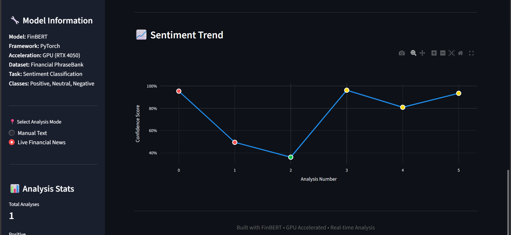

#  PLUS – Financial Sentiment Analysis Platform (FinBERT)

A complete **end-to-end financial sentiment analysis system** built using **FinBERT**, **FastAPI**, and **Streamlit**, powered by **GPU acceleration**.
The platform analyzes **financial news and user-input text**, performs **real-time sentiment prediction**, and visualizes results through an interactive dashboard.

---

##  Project Overview

This project focuses on understanding **market sentiment** from financial text such as:

* News articles
* Earnings reports
* Market commentary

The system uses a **fine-tuned FinBERT transformer model** to classify sentiment into:

* **Positive**
* **Neutral**
* **Negative**

The solution includes:

* Model training & evaluation
* REST API for inference
* Interactive dashboard
* GPU acceleration
* Live news API integration

---

##  Model Details

* **Model:** FinBERT (Transformer-based)
* **Framework:** PyTorch + Hugging Face Transformers
* **Dataset:** Financial PhraseBank
* **Classes:** Positive, Neutral, Negative
* **Hardware:** NVIDIA GeForce RTX 4050 Laptop GPU
* **CUDA:** Enabled ✅

###  Training Summary

```
CUDA available: True
GPU: NVIDIA GeForce RTX 4050 Laptop GPU
Training epochs: 3
Final training loss: ~0.36
Evaluation loss: ~0.44
FINBERT TRAINING COMPLETED SUCCESSFULLY
```

The model was **fine-tuned** on a labeled financial dataset for higher accuracy in the finance domain.

---

##  System Architecture

```
News API / Manual Text Input
            ↓
     Preprocessing Pipeline
            ↓
     FinBERT Model (GPU)
            ↓
        FastAPI Backend
            ↓
     Streamlit Dashboard
```

---

##  Tech Stack

| Layer         | Technology             |
| ------------- | ---------------------- |
| Model         | FinBERT (Hugging Face) |
| Backend       | FastAPI                |
| Frontend      | Streamlit              |
| Visualization | Plotly                 |
| Training      | PyTorch                |
| Data Source   | NewsData API           |
| Hardware      | NVIDIA GPU             |
| Language      | Python                 |

---

## 🌐 News API Integration

* Uses **NewsData API** to fetch live financial news
* News headlines are sent to the sentiment API
* Results are automatically analyzed and displayed
* Manual text input is also supported

> Even though the API is connected, manual input is kept for testing and demo purposes.

---

##  REST API Details

### Health Check

```
GET /
```

Response:

```json
{
  "status": "FinBERT API running"
}
```

### Sentiment Prediction

```
POST /predict
```

Request:

```json
{
  "text": "The company reported strong quarterly profits"
}
```

Response:

```json
{
  "label": "positive",
  "confidence": 0.95,
  "probabilities": {
    "positive": 0.95,
    "neutral": 0.03,
    "negative": 0.02
  }
}
```

---

##  Dashboard Features

* Manual text sentiment analysis
* Live news sentiment analysis
* Confidence score visualization
* Probability breakdown (Positive / Neutral / Negative)
* Sentiment history tracking
* Download results as CSV
* Sentiment trend chart
* GPU-powered real-time inference

---

##  Project Screenshots

###  Manual Sentiment Analysis (Dashboard)


---

### 🌐 Live News API Integration


---

###  Model Evaluation & Trend



---

## ▶ How to Run the Project

### 1️ Create Virtual Environment

```bash
python -m venv .venv
```

Activate:

```bash
# Windows
.venv\Scripts\activate
```

---

### 2️ Install Dependencies

```bash
pip install -r requirements.txt
```

---

### 3️ Start Backend API

```bash
uvicorn api.main:app --host 127.0.0.1 --port 8000
```

API runs at:

```
http://127.0.0.1:8000
```

---

### 4️ Start Dashboard

```bash
streamlit run dashboard/app.py
```

Dashboard opens in browser automatically.

---

##  Project Structure

```
PLUS/
├── api/
│   └── main.py
├── model/
│   └── sentiment_model.py
├── dashboard/
│   └── app.py
├── training/
│   └── finbert_train.py
├── screenshot/
│   ├── manual1.png
│   ├── manual2.png
│   ├── apifetch_1.png
│   ├── apifetch_2.png
│   └── model_evaluation.png
├── requirements.txt
└── README.md
```

---


---

##  Project Outcomes

* Successfully fine-tuned FinBERT on financial data
* Built a production-ready sentiment API
* Implemented GPU-accelerated inference
* Integrated live financial news
* Designed a professional dashboard
* Achieved real-time sentiment visualization


## 👨‍💻 Author

**Chandhresh**
AI / ML Developer
GitHub: [https://github.com/chandhresh](https://github.com/chandhresh)

---
